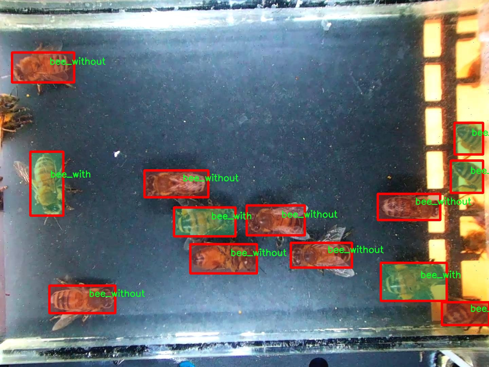

### 1.背景意义

研究背景与意义

随着全球生态环境的变化，蜜蜂作为重要的授粉昆虫，其种群数量的下降引起了广泛关注。蜜蜂不仅在农业生产中扮演着不可或缺的角色，还对维持生态系统的平衡具有重要意义。因此，及时、准确地检测和分类蜜蜂种群，对于生态保护和农业可持续发展具有重要的现实意义。传统的蜜蜂监测方法往往依赖于人工观察和记录，效率低下且容易受到人为因素的影响，难以实现大规模的监测。

近年来，计算机视觉技术的迅猛发展为蜜蜂检测与分类提供了新的解决方案。尤其是基于深度学习的目标检测算法，如YOLO（You Only Look Once），以其高效性和准确性，成为了图像识别领域的研究热点。YOLOv11作为YOLO系列的最新版本，结合了多种先进的技术，能够在实时检测中保持较高的精度和速度。然而，针对蜜蜂的检测与分类任务，现有的YOLO模型仍存在一定的局限性，如对不同种类蜜蜂的细微特征识别能力不足，以及在复杂环境下的鲁棒性有待提高。

本研究旨在基于改进的YOLOv11模型，构建一个高效的蜜蜂检测与分类系统。通过使用包含1400张图像的多样化数据集，该系统能够有效区分蜜蜂与花粉、蜜蜂与非蜜蜂的图像，进而为蜜蜂种群的监测提供准确的数据支持。该数据集不仅涵盖了蜜蜂的不同状态（如有花粉和无花粉），还经过了多种图像增强处理，确保了模型训练的多样性和鲁棒性。通过这一研究，我们希望能够为蜜蜂的保护与监测提供一种新颖的技术手段，促进生态保护与农业可持续发展的结合。

### 2.视频效果

[2.1 视频效果](https://www.bilibili.com/video/BV1UjCcYAEMf/)

### 3.图片效果


##### [项目涉及的源码数据来源链接](https://kdocs.cn/l/cszuIiCKVNis)**

注意：本项目提供训练的数据集和训练教程,由于版本持续更新,暂不提供权重文件（best.pt）,请按照6.训练教程进行训练后实现上图演示的效果。

### 4.数据集信息

##### 4.1 本项目数据集类别数＆类别名

nc: 2
names: ['bee_with', 'bee_without']


该项目为【图像分割】数据集，请在【训练教程和Web端加载模型教程（第三步）】这一步的时候按照【图像分割】部分的教程来训练

##### 4.2 本项目数据集信息介绍

本项目数据集信息介绍

本项目所使用的数据集旨在支持改进YOLOv11的蜜蜂检测与分类系统，数据集的主题为“v1_v2_v3 test”。该数据集专注于蜜蜂的检测与分类，包含两个主要类别：'bee_with'和'bee_without'。这两个类别分别代表了蜜蜂在不同环境和状态下的图像特征，其中'bee_with'指的是蜜蜂在特定背景下的清晰可见状态，而'bee_without'则表示蜜蜂在不明显或隐蔽状态下的图像。这种分类方式不仅能够帮助模型识别蜜蜂的存在与否，还能为后续的生态研究提供重要的数据支持。

数据集的构建经过精心设计，确保了样本的多样性和代表性。图像来源涵盖了不同的环境和时间段，以捕捉蜜蜂在自然栖息地中的多种行为和活动。每个类别的图像均经过标注，确保训练过程中模型能够准确学习到蜜蜂的特征和环境因素对其可见性的影响。此外，数据集的规模经过合理规划，以保证模型在训练时能够获得足够的样本量，从而提高其泛化能力和检测精度。

在数据预处理阶段，图像经过标准化处理，以适应YOLOv11的输入要求。该数据集不仅为蜜蜂的检测提供了基础数据，还为研究蜜蜂的生态行为、种群变化及其对环境的适应能力提供了数据支持。通过对该数据集的训练与测试，期望能够显著提升YOLOv11在蜜蜂检测与分类任务中的性能，进而为蜜蜂保护和生态研究提供更为有效的工具和方法。





### 5.全套项目环境部署视频教程（零基础手把手教学）

[5.1 所需软件PyCharm和Anaconda安装教程（第一步）](https://www.bilibili.com/video/BV1BoC1YCEKi/?spm_id_from=333.999.0.0&vd_source=bc9aec86d164b67a7004b996143742dc)


[5.2 安装Python虚拟环境创建和依赖库安装视频教程（第二步）](https://www.bilibili.com/video/BV1ZoC1YCEBw?spm_id_from=333.788.videopod.sections&vd_source=bc9aec86d164b67a7004b996143742dc)

### 6.改进YOLOv11训练教程和Web_UI前端加载模型教程（零基础手把手教学）

[6.1 改进YOLOv11训练教程和Web_UI前端加载模型教程（第三步）](https://www.bilibili.com/video/BV1BoC1YCEhR?spm_id_from=333.788.videopod.sections&vd_source=bc9aec86d164b67a7004b996143742dc)


按照上面的训练视频教程链接加载项目提供的数据集，运行train.py即可开始训练



     Epoch   gpu_mem       box       obj       cls    labels  img_size
     1/200     20.8G   0.01576   0.01955  0.007536        22      1280: 100%|██████████| 849/849 [14:42<00:00,  1.04s/it]
               Class     Images     Labels          P          R     mAP@.5 mAP@.5:.95: 100%|██████████| 213/213 [01:14<00:00,  2.87it/s]
                 all       3395      17314      0.994      0.957      0.0957      0.0843

     Epoch   gpu_mem       box       obj       cls    labels  img_size
     2/200     20.8G   0.01578   0.01923  0.007006        22      1280: 100%|██████████| 849/849 [14:44<00:00,  1.04s/it]
               Class     Images     Labels          P          R     mAP@.5 mAP@.5:.95: 100%|██████████| 213/213 [01:12<00:00,  2.95it/s]
                 all       3395      17314      0.996      0.956      0.0957      0.0845

     Epoch   gpu_mem       box       obj       cls    labels  img_size
     3/200     20.8G   0.01561    0.0191  0.006895        27      1280: 100%|██████████| 849/849 [10:56<00:00,  1.29it/s]
               Class     Images     Labels          P          R     mAP@.5 mAP@.5:.95: 100%|███████   | 187/213 [00:52<00:00,  4.04it/s]
                 all       3395      17314      0.996      0.957      0.0957      0.0845


###### [项目数据集下载链接](https://kdocs.cn/l/cszuIiCKVNis)

### 7.原始YOLOv11算法讲解

YOLO11采用改进的骨干和颈部架构，增强了特征提取能力，提高了物体检测的精确度和复杂任务的表现。YOLO11引入精炼的架构设计和优化的训练流程，实现更快的处理速度，同时保持精度和性能之间的最佳平衡。通过模型设计的进步，YOLO11m在COCO数据集上实现了更高的均值平均精度（mAP），同时使用比YOLOv8m少22%的参数，使其在不妥协准确性的情况下更加计算高效。YOLO11可以无缝部署在各种环境中，包括边缘设备、云平台以及支持NVIDIA
GPU的系统，确保最大灵活性。无论是物体检测、实例分割、图像分类、姿态估计，还是定向物体检测（OBB），YOLO11都旨在应对多样的计算机视觉挑战。


##### **Ultralytics YOLO11相比于之前版本的主要改进有哪些？**

Ultralytics YOLO11在其前身基础上引入了几项重要进步。主要改进包括：

  1. **增强的特征提取** ：YOLO11采用改进的骨干和颈部架构，增强了特征提取能力，提高了物体检测的精确度。
  2.  **优化的效率和速度** ：精炼的架构设计和优化的训练流程实现了更快的处理速度，同时保持了准确性和性能之间的平衡。
  3.  **更高的准确性与更少的参数** ：YOLO11m在COCO数据集上实现了更高的均值平均精度（mAP），同时使用比YOLOv8m少22%的参数，使其在不妥协准确性的情况下更加计算高效。
  4.  **环境适应性强** ：YOLO11可以在多种环境中部署，包括边缘设备、云平台以及支持NVIDIA GPU的系统。
  5.  **支持广泛的任务** ：YOLO11支持多种计算机视觉任务，如物体检测、实例分割、图像分类、姿态估计和定向物体检测（OBB）。

我们先来看一下其网络结构有什么变化，可以看出，相比较于YOLOv8模型，其将CF2模块改成C3K2，同时在SPPF模块后面添加了一个C2PSA模块，且将YOLOv10的head思想引入到YOLO11的head中，使用深度可分离的方法，减少冗余计算，提高效率。下面我们来详细看一下这两个模块的结构是怎么构成的，以及它们为什么要这样设计


##### C3K2的网络结构

从下面图中我们可以看到，C3K2模块其实就是C2F模块转变出来的，它代码中有一个设置，就是当c3k这个参数为FALSE的时候，C3K2模块就是C2F模块，也就是说它的Bottleneck是普通的Bottleneck；反之当它为true的时候，将Bottleneck模块替换成C3模块。


##### C2PSA的网络结构

` `C2PSA是对 `C2f` 模块的扩展，它结合了PSA(Pointwise Spatial
Attention)块，用于增强特征提取和注意力机制。通过在标准 `C2f` 模块中引入 PSA
块，C2PSA实现了更强大的注意力机制，从而提高了模型对重要特征的捕捉能力。


##### **C2f 模块回顾：**

**** C2f模块是一个更快的 CSP（Cross Stage Partial）瓶颈实现，它通过两个卷积层和多个 Bottleneck
块进行特征提取。相比传统的 CSPNet，C2f 优化了瓶颈层的结构，使得计算速度更快。在 C2f中，`cv1` 是第一个 1x1
卷积，用于减少通道数；`cv2` 是另一个 1x1 卷积，用于恢复输出通道数。而 `n` 是一个包含 Bottleneck 块的数量，用于提取特征。

##### **C2PSA 模块的增强** ：

**C2PSA** 扩展了 C2f，通过引入PSA( **Position-Sensitive Attention)**
，旨在通过多头注意力机制和前馈神经网络来增强特征提取能力。它可以选择性地添加残差结构（shortcut）以优化梯度传播和网络训练效果。同时，使用FFN
可以将输入特征映射到更高维的空间，捕获输入特征的复杂非线性关系，允许模型学习更丰富的特征表示。

##### head部分

YOLO11在head部分的cls分支上使用深度可分离卷积 ，具体代码如下，cv2边界框回归分支，cv3分类分支。

    
    
     self.cv2 = nn.ModuleList(
                nn.Sequential(Conv(x, c2, 3), Conv(c2, c2, 3), nn.Conv2d(c2, 4 * self.reg_max, 1)) for x in ch
            )
            self.cv3 = nn.ModuleList(
                nn.Sequential(
                    nn.Sequential(DWConv(x, x, 3), Conv(x, c3, 1)),
                    nn.Sequential(DWConv(c3, c3, 3), Conv(c3, c3, 1)),
                    nn.Conv2d(c3, self.nc, 1),
                )
                for x in ch
            )


### 8.200+种全套改进YOLOV11创新点原理讲解

#### 8.1 200+种全套改进YOLOV11创新点原理讲解大全

由于篇幅限制，每个创新点的具体原理讲解就不全部展开，具体见下列网址中的改进模块对应项目的技术原理博客网址【Blog】（创新点均为模块化搭建，原理适配YOLOv5~YOLOv11等各种版本）

[改进模块技术原理博客【Blog】网址链接](https://gitee.com/qunmasj/good)


#### 8.2 精选部分改进YOLOV11创新点原理讲解

###### 这里节选部分改进创新点展开原理讲解(完整的改进原理见上图和[改进模块技术原理博客链接](https://gitee.com/qunmasj/good)【如果此小节的图加载失败可以通过CSDN或者Github搜索该博客的标题访问原始博客，原始博客图片显示正常】

### Gold-YOLO


#### Preliminaries
YOLO系列的中间层结构采用了传统的FPN结构，其中包含多个分支用于多尺度特征融合。然而，它只充分融合来自相邻级别的特征，对于其他层次的信息只能间接地进行“递归”获取。

传统的FPN结构在信息传输过程中存在丢失大量信息的问题。这是因为层之间的信息交互仅限于中间层选择的信息，未被选择的信息在传输过程中被丢弃。这种情况导致某个Level的信息只能充分辅助相邻层，而对其他全局层的帮助较弱。因此，整体上信息融合的有效性可能受到限制。
为了避免在传输过程中丢失信息，本文采用了一种新颖的“聚集和分发”机制（GD），放弃了原始的递归方法。该机制使用一个统一的模块来收集和融合所有Level的信息，并将其分发到不同的Level。通过这种方式，作者不仅避免了传统FPN结构固有的信息丢失问题，还增强了中间层的部分信息融合能力，而且并没有显著增加延迟。


#### 低阶聚合和分发分支 Low-stage gather-and-distribute branch
从主干网络中选择输出的B2、B3、B4、B5特征进行融合，以获取保留小目标信息的高分辨率特征。


#### 高阶聚合和分发分支 High-stage gather-and-distribute branch
高级全局特征对齐模块（High-GD）将由低级全局特征对齐模块（Low-GD）生成的特征{P3, P4, P5}进行融合。


Transformer融合模块由多个堆叠的transformer组成，transformer块的数量为L。每个transformer块包括一个多头注意力块、一个前馈网络（FFN）和残差连接。采用与LeViT相同的设置来配置多头注意力块，使用16个通道作为键K和查询Q的头维度，32个通道作为值V的头维度。为了加速推理过程，将层归一化操作替换为批归一化，并将所有的GELU激活函数替换为ReLU。为了增强变换器块的局部连接，在两个1x1卷积层之间添加了一个深度卷积层。同时，将FFN的扩展因子设置为2，以在速度和计算成本之间取得平衡。


信息注入模块(Information injection module)： 高级全局特征对齐模块（High-GD）中的信息注入模块与低级全局特征对齐模块（Low-GD）中的相同。在高级阶段，局部特征（Flocal）等于Pi，因此公式如下所示：


#### 增强的跨层信息流动 Enhanced cross-layer information flow
为了进一步提升性能，从YOLOv6 中的PAFPN模块中得到启发，引入了Inject-LAF模块。该模块是注入模块的增强版，包括了一个轻量级相邻层融合（LAF）模块，该模块被添加到注入模块的输入位置。为了在速度和准确性之间取得平衡，设计了两个LAF模型：LAF低级模型和LAF高级模型，分别用于低级注入（合并相邻两层的特征）和高级注入（合并相邻一层的特征）。它们的结构如图5(b)所示。为了确保来自不同层级的特征图与目标大小对齐，在实现中的两个LAF模型仅使用了三个操作符：双线性插值（上采样过小的特征）、平均池化（下采样过大的特征）和1x1卷积（调整与目标通道不同的特征）。模型中的LAF模块与信息注入模块的结合有效地平衡了准确性和速度之间的关系。通过使用简化的操作，能够增加不同层级之间的信息流路径数量，从而提高性能而不显著增加延迟。


### 9.系统功能展示

图9.1.系统支持检测结果表格显示

  图9.2.系统支持置信度和IOU阈值手动调节

  图9.3.系统支持自定义加载权重文件best.pt(需要你通过步骤5中训练获得)

  图9.4.系统支持摄像头实时识别

  图9.5.系统支持图片识别

  图9.6.系统支持视频识别

  图9.7.系统支持识别结果文件自动保存

  图9.8.系统支持Excel导出检测结果数据


### 10. YOLOv11核心改进源码讲解

#### 10.1 starnet.py

以下是对代码的逐文件分析，保留了最核心的部分，并添加了详细的中文注释：

```python
"""
实现概念验证网络：StarNet。

我们将StarNet设计得尽可能简单，以展示逐元素乘法的关键贡献：
    - 网络设计中没有层级缩放，
    - 训练过程中没有EMA，
    - 这些都可以进一步提高性能。

创建者：Xu Ma (邮箱: ma.xu1@northeastern.edu)
修改日期：2024年3月29日
"""

import torch
import torch.nn as nn
from timm.models.layers import DropPath, trunc_normal_

# 定义可用的模型名称
__all__ = ['starnet_s050', 'starnet_s100', 'starnet_s150', 'starnet_s1', 'starnet_s2', 'starnet_s3', 'starnet_s4']

# 预训练模型的URL
model_urls = {
    "starnet_s1": "https://github.com/ma-xu/Rewrite-the-Stars/releases/download/checkpoints_v1/starnet_s1.pth.tar",
    "starnet_s2": "https://github.com/ma-xu/Rewrite-the-Stars/releases/download/checkpoints_v1/starnet_s2.pth.tar",
    "starnet_s3": "https://github.com/ma-xu/Rewrite-the-Stars/releases/download/checkpoints_v1/starnet_s3.pth.tar",
    "starnet_s4": "https://github.com/ma-xu/Rewrite-the-Stars/releases/download/checkpoints_v1/starnet_s4.pth.tar",
}

# 定义卷积层和批归一化的组合
class ConvBN(torch.nn.Sequential):
    def __init__(self, in_planes, out_planes, kernel_size=1, stride=1, padding=0, dilation=1, groups=1, with_bn=True):
        super().__init__()
        # 添加卷积层
        self.add_module('conv', torch.nn.Conv2d(in_planes, out_planes, kernel_size, stride, padding, dilation, groups))
        # 如果需要，添加批归一化层
        if with_bn:
            self.add_module('bn', torch.nn.BatchNorm2d(out_planes))
            # 初始化批归一化的权重和偏置
            torch.nn.init.constant_(self.bn.weight, 1)
            torch.nn.init.constant_(self.bn.bias, 0)

# 定义网络的基本模块
class Block(nn.Module):
    def __init__(self, dim, mlp_ratio=3, drop_path=0.):
        super().__init__()
        # 深度可分离卷积
        self.dwconv = ConvBN(dim, dim, 7, 1, (7 - 1) // 2, groups=dim, with_bn=True)
        # 1x1卷积，用于特征映射的扩展
        self.f1 = ConvBN(dim, mlp_ratio * dim, 1, with_bn=False)
        self.f2 = ConvBN(dim, mlp_ratio * dim, 1, with_bn=False)
        self.g = ConvBN(mlp_ratio * dim, dim, 1, with_bn=True)
        self.dwconv2 = ConvBN(dim, dim, 7, 1, (7 - 1) // 2, groups=dim, with_bn=False)
        self.act = nn.ReLU6()  # 激活函数
        self.drop_path = DropPath(drop_path) if drop_path > 0. else nn.Identity()  # 随机深度

    def forward(self, x):
        input = x  # 保存输入
        x = self.dwconv(x)  # 深度可分离卷积
        x1, x2 = self.f1(x), self.f2(x)  # 通过两个1x1卷积
        x = self.act(x1) * x2  # 元素级乘法
        x = self.dwconv2(self.g(x))  # 通过最后的卷积
        x = input + self.drop_path(x)  # 残差连接
        return x

# 定义StarNet模型
class StarNet(nn.Module):
    def __init__(self, base_dim=32, depths=[3, 3, 12, 5], mlp_ratio=4, drop_path_rate=0.0, num_classes=1000, **kwargs):
        super().__init__()
        self.num_classes = num_classes
        self.in_channel = 32
        # stem层
        self.stem = nn.Sequential(ConvBN(3, self.in_channel, kernel_size=3, stride=2, padding=1), nn.ReLU6())
        dpr = [x.item() for x in torch.linspace(0, drop_path_rate, sum(depths))]  # 随机深度
        # 构建各个阶段
        self.stages = nn.ModuleList()
        cur = 0
        for i_layer in range(len(depths)):
            embed_dim = base_dim * 2 ** i_layer  # 当前阶段的嵌入维度
            down_sampler = ConvBN(self.in_channel, embed_dim, 3, 2, 1)  # 下采样
            self.in_channel = embed_dim
            blocks = [Block(self.in_channel, mlp_ratio, dpr[cur + i]) for i in range(depths[i_layer])]  # 添加Block
            cur += depths[i_layer]
            self.stages.append(nn.Sequential(down_sampler, *blocks))  # 将下采样和Block组合成一个阶段
        
        # 初始化权重
        self.apply(self._init_weights)

    def _init_weights(self, m):
        # 权重初始化
        if isinstance(m, (nn.Linear, nn.Conv2d)):
            trunc_normal_(m.weight, std=.02)  # 正态分布初始化
            if isinstance(m, nn.Linear) and m.bias is not None:
                nn.init.constant_(m.bias, 0)  # 偏置初始化为0
        elif isinstance(m, (nn.LayerNorm, nn.BatchNorm2d)):
            nn.init.constant_(m.bias, 0)
            nn.init.constant_(m.weight, 1.0)

    def forward(self, x):
        features = []  # 特征列表
        x = self.stem(x)  # 通过stem层
        features.append(x)  # 保存特征
        for stage in self.stages:
            x = stage(x)  # 通过每个阶段
            features.append(x)  # 保存特征
        return features  # 返回所有特征

# 定义不同大小的StarNet模型
def starnet_s1(pretrained=False, **kwargs):
    model = StarNet(24, [2, 2, 8, 3], **kwargs)  # 定义模型
    if pretrained:
        url = model_urls['starnet_s1']
        checkpoint = torch.hub.load_state_dict_from_url(url=url, map_location="cpu")  # 加载预训练权重
        model.load_state_dict(checkpoint["state_dict"], strict=False)  # 加载状态字典
    return model

def starnet_s2(pretrained=False, **kwargs):
    model = StarNet(32, [1, 2, 6, 2], **kwargs)
    if pretrained:
        url = model_urls['starnet_s2']
        checkpoint = torch.hub.load_state_dict_from_url(url=url, map_location="cpu")
        model.load_state_dict(checkpoint["state_dict"], strict=False)
    return model

def starnet_s3(pretrained=False, **kwargs):
    model = StarNet(32, [2, 2, 8, 4], **kwargs)
    if pretrained:
        url = model_urls['starnet_s3']
        checkpoint = torch.hub.load_state_dict_from_url(url=url, map_location="cpu")
        model.load_state_dict(checkpoint["state_dict"], strict=False)
    return model

def starnet_s4(pretrained=False, **kwargs):
    model = StarNet(32, [3, 3, 12, 5], **kwargs)
    if pretrained:
        url = model_urls['starnet_s4']
        checkpoint = torch.hub.load_state_dict_from_url(url=url, map_location="cpu")
        model.load_state_dict(checkpoint["state_dict"], strict=False)
    return model

# 定义非常小的网络
def starnet_s050(pretrained=False, **kwargs):
    return StarNet(16, [1, 1, 3, 1], 3, **kwargs)

def starnet_s100(pretrained=False, **kwargs):
    return StarNet(20, [1, 2, 4, 1], 4, **kwargs)

def starnet_s150(pretrained=False, **kwargs):
    return StarNet(24, [1, 2, 4, 2], 3, **kwargs)
```

### 代码核心部分分析：
1. **ConvBN类**：实现了卷积层和批归一化的组合，简化了网络结构的构建。
2. **Block类**：实现了StarNet的基本构建块，包含深度可分离卷积和元素级乘法，体现了网络的核心思想。
3. **StarNet类**：构建了整个网络结构，包括stem层和多个阶段，每个阶段由下采样和多个Block组成。
4. **模型构建函数**：提供了不同规模的StarNet模型的构建方式，并支持加载预训练权重。

通过这些核心部分的组合，StarNet实现了高效的特征提取和表示学习。

这个程序文件实现了一个名为StarNet的神经网络模型，主要用于深度学习中的图像处理任务。文件开头的文档字符串简要介绍了StarNet的设计理念，强调了模型的简洁性，特别是对元素级乘法的关键贡献，并指出在网络设计中没有使用层缩放（layer-scale）和训练期间的指数移动平均（EMA），这些设计的缺失可能会进一步提升模型性能。

程序中首先导入了必要的库，包括PyTorch和一些自定义的层。接着定义了一个包含不同StarNet模型的列表，方便后续调用。模型的预训练权重存储在一个字典中，提供了多个不同版本的StarNet模型的下载链接。

接下来定义了一个名为`ConvBN`的类，它是一个组合层，包含卷积层和批归一化层。这个类的构造函数接受多个参数来配置卷积层的属性，并在初始化时添加批归一化层（如果需要的话），同时对批归一化层的权重和偏置进行了初始化。

然后定义了`Block`类，这是StarNet的基本构建块。每个Block包含一个深度卷积层、两个卷积层和一个线性激活函数（ReLU6）。在前向传播中，输入首先经过深度卷积，然后通过两个卷积层生成两个特征图，接着进行元素级乘法操作，最后通过另一个卷积层和残差连接返回输出。

`StarNet`类是整个网络的核心。它的构造函数定义了网络的基本结构，包括一个stem层和多个阶段（stages）。stem层负责初步处理输入图像，而每个阶段由下采样层和多个Block组成。网络的深度和宽度通过`depths`和`base_dim`参数进行配置。为了实现随机深度，使用了一个线性空间生成drop path的比率。网络的权重在初始化时也进行了设置。

`_init_weights`方法用于初始化网络中各层的权重，采用了截断正态分布的方式，并对偏置进行了适当的初始化。

在`forward`方法中，输入数据依次通过stem层和各个阶段，最终返回特征图列表。

文件最后定义了一些函数（如`starnet_s1`、`starnet_s2`等），这些函数用于创建不同配置的StarNet模型，并提供了加载预训练权重的选项。每个函数都调用了StarNet构造函数，并根据需要下载相应的预训练模型。

此外，还有一些非常小的网络版本（如`starnet_s050`、`starnet_s100`和`starnet_s150`），这些版本的设计旨在提供更轻量级的模型，以适应不同的应用场景。

整体来看，这个文件展示了StarNet模型的结构和实现细节，强调了其在设计上的简洁性和灵活性，适合用于各种图像处理任务。

#### 10.2 kan_conv.py

以下是经过简化并添加详细中文注释的核心代码部分：

```python
import torch
import torch.nn as nn

class KANConvNDLayer(nn.Module):
    def __init__(self, conv_class, norm_class, input_dim, output_dim, spline_order, kernel_size,
                 groups=1, padding=0, stride=1, dilation=1,
                 ndim: int = 2, grid_size=5, base_activation=nn.GELU, grid_range=[-1, 1], dropout=0.0):
        super(KANConvNDLayer, self).__init__()
        
        # 初始化参数
        self.inputdim = input_dim  # 输入维度
        self.outdim = output_dim    # 输出维度
        self.spline_order = spline_order  # 样条阶数
        self.kernel_size = kernel_size  # 卷积核大小
        self.padding = padding  # 填充
        self.stride = stride  # 步幅
        self.dilation = dilation  # 膨胀
        self.groups = groups  # 分组数
        self.ndim = ndim  # 维度
        self.grid_size = grid_size  # 网格大小
        self.base_activation = base_activation()  # 基础激活函数
        self.grid_range = grid_range  # 网格范围

        # 初始化dropout层
        self.dropout = None
        if dropout > 0:
            if ndim == 1:
                self.dropout = nn.Dropout1d(p=dropout)
            elif ndim == 2:
                self.dropout = nn.Dropout2d(p=dropout)
            elif ndim == 3:
                self.dropout = nn.Dropout3d(p=dropout)

        # 参数有效性检查
        if groups <= 0:
            raise ValueError('groups must be a positive integer')
        if input_dim % groups != 0:
            raise ValueError('input_dim must be divisible by groups')
        if output_dim % groups != 0:
            raise ValueError('output_dim must be divisible by groups')

        # 创建基础卷积层和样条卷积层
        self.base_conv = nn.ModuleList([conv_class(input_dim // groups,
                                                   output_dim // groups,
                                                   kernel_size,
                                                   stride,
                                                   padding,
                                                   dilation,
                                                   groups=1,
                                                   bias=False) for _ in range(groups)])

        self.spline_conv = nn.ModuleList([conv_class((grid_size + spline_order) * input_dim // groups,
                                                     output_dim // groups,
                                                     kernel_size,
                                                     stride,
                                                     padding,
                                                     dilation,
                                                     groups=1,
                                                     bias=False) for _ in range(groups)])

        # 创建归一化层和激活层
        self.layer_norm = nn.ModuleList([norm_class(output_dim // groups) for _ in range(groups)])
        self.prelus = nn.ModuleList([nn.PReLU() for _ in range(groups)])

        # 生成样条网格
        h = (self.grid_range[1] - self.grid_range[0]) / grid_size
        self.grid = torch.linspace(
            self.grid_range[0] - h * spline_order,
            self.grid_range[1] + h * spline_order,
            grid_size + 2 * spline_order + 1,
            dtype=torch.float32
        )

        # 初始化卷积层权重
        for conv_layer in self.base_conv:
            nn.init.kaiming_uniform_(conv_layer.weight, nonlinearity='linear')

        for conv_layer in self.spline_conv:
            nn.init.kaiming_uniform_(conv_layer.weight, nonlinearity='linear')

    def forward_kan(self, x, group_index):
        # 基础卷积的前向传播
        base_output = self.base_conv[group_index](self.base_activation(x))

        # 扩展维度以进行样条操作
        x_uns = x.unsqueeze(-1)
        target = x.shape[1:] + self.grid.shape
        grid = self.grid.view(*list([1 for _ in range(self.ndim + 1)] + [-1, ])).expand(target).contiguous().to(x.device)

        # 计算样条基
        bases = ((x_uns >= grid[..., :-1]) & (x_uns < grid[..., 1:])).to(x.dtype)

        # 计算样条基的多个阶数
        for k in range(1, self.spline_order + 1):
            left_intervals = grid[..., :-(k + 1)]
            right_intervals = grid[..., k:-1]
            delta = torch.where(right_intervals == left_intervals, torch.ones_like(right_intervals),
                                right_intervals - left_intervals)
            bases = ((x_uns - left_intervals) / delta * bases[..., :-1]) + \
                    ((grid[..., k + 1:] - x_uns) / (grid[..., k + 1:] - grid[..., 1:(-k)]) * bases[..., 1:])
        bases = bases.contiguous()
        bases = bases.moveaxis(-1, 2).flatten(1, 2)

        # 通过样条卷积层得到输出
        spline_output = self.spline_conv[group_index](bases)
        x = self.prelus[group_index](self.layer_norm[group_index](base_output + spline_output))

        # 应用dropout
        if self.dropout is not None:
            x = self.dropout(x)

        return x

    def forward(self, x):
        # 将输入分成多个组进行处理
        split_x = torch.split(x, self.inputdim // self.groups, dim=1)
        output = []
        for group_ind, _x in enumerate(split_x):
            y = self.forward_kan(_x.clone(), group_ind)
            output.append(y.clone())
        y = torch.cat(output, dim=1)  # 合并输出
        return y
```

### 代码说明：
1. **类定义**：`KANConvNDLayer` 是一个自定义的卷积层，支持多维卷积（1D、2D、3D）。
2. **初始化方法**：在构造函数中，初始化卷积层、归一化层、激活函数、样条网格等。
3. **前向传播**：`forward_kan` 方法实现了卷积层的前向传播逻辑，包括基础卷积和样条卷积的计算。
4. **样条基计算**：通过输入值和样条网格计算样条基，用于生成样条卷积的输入。
5. **分组处理**：`forward` 方法将输入数据分成多个组，分别进行处理后合并输出。

这个程序文件定义了一个名为 `KANConvNDLayer` 的神经网络层，主要用于实现具有样条基函数的卷积操作。该层可以处理多维数据，支持一维、二维和三维卷积，具体通过子类 `KANConv1DLayer`、`KANConv2DLayer` 和 `KANConv3DLayer` 实现。

在 `KANConvNDLayer` 的构造函数中，首先初始化了一些参数，包括输入和输出维度、卷积核大小、样条阶数、分组数、填充、步幅、扩张、网格大小、基础激活函数、网格范围和 dropout 比例。构造函数还会检查分组数和输入输出维度的有效性。

接下来，构造函数创建了基础卷积层和样条卷积层的模块列表。基础卷积层使用传入的卷积类（如 `nn.Conv1d`、`nn.Conv2d` 或 `nn.Conv3d`）来构建，而样条卷积层则根据样条阶数和网格大小进行构建。层归一化和 PReLU 激活函数也被初始化。

在 `forward_kan` 方法中，输入数据首先经过基础激活函数处理，然后通过基础卷积层进行线性变换。接着，程序计算样条基函数，使用输入数据和预定义的网格进行样条插值。样条基函数的计算涉及到对输入数据的区间划分和插值操作，最终得到样条卷积的输出。

在 `forward` 方法中，输入数据根据分组数进行拆分，并对每个分组调用 `forward_kan` 方法进行处理，最后将所有分组的输出拼接在一起。

`KANConv3DLayer`、`KANConv2DLayer` 和 `KANConv1DLayer` 类分别继承自 `KANConvNDLayer`，并在构造函数中指定相应的卷积和归一化类。这使得用户可以方便地创建适用于不同维度的卷积层。

总的来说，这个程序文件实现了一个灵活且功能强大的卷积层，结合了样条插值和深度学习中的常用技术，适用于多种应用场景。

#### 10.3 SMPConv.py

以下是经过简化并注释的核心代码部分，主要集中在 `SMPConv` 和 `SMPCNN` 类的实现上：

```python
import torch
import torch.nn as nn
import torch.nn.functional as F

# 定义一个函数，用于生成相对位置的坐标
def rel_pos(kernel_size):
    # 生成一个从 -1 到 1 的线性空间，大小为 kernel_size
    tensors = [torch.linspace(-1, 1, steps=kernel_size) for _ in range(2)]
    # 使用 meshgrid 生成网格坐标
    kernel_coord = torch.stack(torch.meshgrid(*tensors), dim=-0)
    kernel_coord = kernel_coord.unsqueeze(0)  # 增加一个维度
    return kernel_coord

# 定义一个自定义卷积层 SMPConv
class SMPConv(nn.Module):
    def __init__(self, planes, kernel_size, n_points, stride, padding, groups):
        super().__init__()

        self.planes = planes  # 输出通道数
        self.kernel_size = kernel_size  # 卷积核大小
        self.n_points = n_points  # 采样点数量
        self.init_radius = 2 * (2/kernel_size)  # 初始化半径

        # 生成卷积核的相对位置坐标
        kernel_coord = rel_pos(kernel_size)
        self.register_buffer('kernel_coord', kernel_coord)  # 注册为缓冲区，不会被视为模型参数

        # 初始化权重坐标
        weight_coord = torch.empty(1, n_points, 2)
        nn.init.trunc_normal_(weight_coord, std=0.2, a=-1., b=1.)  # 截断正态分布初始化
        self.weight_coord = nn.Parameter(weight_coord)  # 注册为可训练参数

        # 初始化半径参数
        self.radius = nn.Parameter(torch.empty(1, n_points).unsqueeze(-1).unsqueeze(-1))
        self.radius.data.fill_(value=self.init_radius)  # 填充初始值

        # 初始化卷积权重
        weights = torch.empty(1, planes, n_points)
        nn.init.trunc_normal_(weights, std=.02)  # 截断正态分布初始化
        self.weights = nn.Parameter(weights)  # 注册为可训练参数

    def forward(self, x):
        # 生成卷积核并应用卷积操作
        kernels = self.make_kernels().unsqueeze(1)  # 生成卷积核
        x = x.contiguous()  # 确保输入张量是连续的
        kernels = kernels.contiguous()  # 确保卷积核是连续的

        # 根据输入数据类型选择合适的卷积实现
        if x.dtype == torch.float32:
            x = _DepthWiseConv2dImplicitGEMMFP32.apply(x, kernels)
        elif x.dtype == torch.float16:
            x = _DepthWiseConv2dImplicitGEMMFP16.apply(x, kernels)
        else:
            raise TypeError("Only support fp32 and fp16, get {}".format(x.dtype))
        return x        

    def make_kernels(self):
        # 计算卷积核
        diff = self.weight_coord.unsqueeze(-2) - self.kernel_coord.reshape(1, 2, -1).transpose(1, 2)  # 计算权重坐标与卷积核坐标的差
        diff = diff.transpose(2, 3).reshape(1, self.n_points, 2, self.kernel_size, self.kernel_size)  # 重塑形状
        diff = F.relu(1 - torch.sum(torch.abs(diff), dim=2) / self.radius)  # 计算差的非线性变换
        
        # 计算最终的卷积核
        kernels = torch.matmul(self.weights, diff.reshape(1, self.n_points, -1))  # 加权平均
        kernels = kernels.reshape(1, self.planes, *self.kernel_coord.shape[2:])  # 重塑形状
        kernels = kernels.squeeze(0)  # 去掉多余的维度
        kernels = torch.flip(kernels.permute(0, 2, 1), dims=(1,))  # 反转卷积核
        return kernels

# 定义一个自定义卷积神经网络 SMPCNN
class SMPCNN(nn.Module):
    def __init__(self, in_channels, out_channels, kernel_size, stride, groups, n_points=None, n_points_divide=4):
        super().__init__()
        self.kernel_size = kernel_size
        if n_points is None:
            n_points = int((kernel_size**2) // n_points_divide)  # 计算采样点数量

        padding = kernel_size // 2  # 计算填充
        # 使用自定义卷积层
        self.smp = conv_bn(in_channels=in_channels, out_channels=out_channels, kernel_size=kernel_size,
                           stride=stride, padding=padding, dilation=1, groups=groups, n_points=n_points)
        
        self.small_kernel = 5  # 小卷积核大小
        # 使用小卷积层
        self.small_conv = Conv(in_channels, out_channels, self.small_kernel, stride, self.small_kernel // 2, groups, act=False)

    def forward(self, inputs):
        # 前向传播
        out = self.smp(inputs)  # 通过自定义卷积层
        out += self.small_conv(inputs)  # 加上小卷积层的输出
        return out
```

### 代码注释说明：
1. **`rel_pos` 函数**：生成卷积核的相对位置坐标，用于后续的卷积操作。
2. **`SMPConv` 类**：自定义卷积层，包含了权重和卷积核的生成逻辑。它通过计算权重坐标与卷积核坐标的差异来生成卷积核，并根据输入数据类型选择合适的卷积实现。
3. **`make_kernels` 方法**：负责生成卷积核的具体实现。
4. **`SMPCNN` 类**：定义了一个包含自定义卷积层和小卷积层的神经网络结构。通过前向传播方法将两者的输出相加。

这个程序文件 `SMPConv.py` 实现了一种特殊的卷积模块，主要用于深度学习中的卷积神经网络（CNN）。它包含多个类和函数，主要功能是定义和实现一个自适应的卷积操作，利用可学习的参数来生成卷积核，从而提高模型的表现。

首先，文件导入了必要的库，包括 PyTorch 的核心模块和一些自定义模块。接着，定义了一个 `rel_pos` 函数，用于生成相对位置的坐标张量，这对于后续的卷积核生成是必要的。

`SMPConv` 类是这个文件的核心。它的构造函数接收多个参数，包括输出通道数、卷积核大小、点数、步幅、填充和分组数。类内部首先初始化了一些参数，包括相对位置的坐标、权重坐标和半径。权重和半径都是可学习的参数。`forward` 方法定义了前向传播过程，其中调用了 `make_kernels` 方法生成卷积核，并根据输入数据的类型选择不同的深度可分离卷积实现。

`make_kernels` 方法通过计算权重坐标与卷积核坐标之间的差异，生成卷积核。它使用了 ReLU 激活函数来处理这些差异，并通过加权平均的方式得到最终的卷积核。

`radius_clip` 方法用于限制半径的范围，确保其在合理的范围内。

接下来的几个函数如 `get_conv2d`、`get_bn` 和 `conv_bn` 等，分别用于获取卷积层、批归一化层和组合这两者的序列模块。这些函数提供了灵活的接口，以便在不同的情况下选择合适的卷积实现。

`SMPCNN` 类是一个组合卷积模块，它将 `SMPConv` 和一个小卷积层结合在一起，以便于提取不同尺度的特征。`SMPCNN_ConvFFN` 类则实现了一个前馈网络模块，包含两个逐点卷积层和一个非线性激活函数。

最后，`SMPBlock` 类定义了一个包含多个卷积层的模块，结合了前馈网络和卷积操作，使用残差连接和 DropPath 技术来增强网络的表现。

整体来看，这个文件实现了一种新的卷积结构，旨在通过动态生成卷积核和结合不同类型的卷积操作来提高模型的表达能力和性能。

#### 10.4 test_selective_scan.py

以下是保留的核心代码部分，并附上详细的中文注释：

```python
import torch
import torch.nn.functional as F

def build_selective_scan_fn(selective_scan_cuda: object = None, mode="mamba_ssm"):
    """
    构建选择性扫描函数
    :param selective_scan_cuda: CUDA实现的选择性扫描函数
    :param mode: 模式选择
    :return: 选择性扫描函数
    """
    
    class SelectiveScanFn(torch.autograd.Function):
        @staticmethod
        def forward(ctx, u, delta, A, B, C, D=None, z=None, delta_bias=None, delta_softplus=False, return_last_state=False):
            """
            前向传播函数
            :param ctx: 上下文对象，用于保存状态
            :param u: 输入张量
            :param delta: 增量张量
            :param A, B, C: 权重张量
            :param D: 可选的额外张量
            :param z: 可选的张量
            :param delta_bias: 可选的增量偏置
            :param delta_softplus: 是否使用softplus激活
            :param return_last_state: 是否返回最后状态
            :return: 输出张量或输出和最后状态
            """
            # 确保输入张量是连续的
            if u.stride(-1) != 1:
                u = u.contiguous()
            if delta.stride(-1) != 1:
                delta = delta.contiguous()
            if D is not None:
                D = D.contiguous()
            if B.stride(-1) != 1:
                B = B.contiguous()
            if C.stride(-1) != 1:
                C = C.contiguous()
            if z is not None and z.stride(-1) != 1:
                z = z.contiguous()

            # 进行选择性扫描的CUDA实现
            out, x, *rest = selective_scan_cuda.fwd(u, delta, A, B, C, D, z, delta_bias, delta_softplus)

            # 保存必要的张量以供反向传播使用
            ctx.save_for_backward(u, delta, A, B, C, D, delta_bias, x)

            # 返回输出或输出和最后状态
            last_state = x[:, :, -1, 1::2]  # 获取最后状态
            return out if not return_last_state else (out, last_state)

        @staticmethod
        def backward(ctx, dout):
            """
            反向传播函数
            :param ctx: 上下文对象
            :param dout: 输出的梯度
            :return: 输入的梯度
            """
            # 从上下文中恢复保存的张量
            u, delta, A, B, C, D, delta_bias, x = ctx.saved_tensors
            
            # 进行反向传播的CUDA实现
            du, ddelta, dA, dB, dC, dD, ddelta_bias, *rest = selective_scan_cuda.bwd(
                u, delta, A, B, C, D, delta_bias, dout, x
            )

            return du, ddelta, dA, dB, dC, dD, ddelta_bias

    def selective_scan_fn(u, delta, A, B, C, D=None, z=None, delta_bias=None, delta_softplus=False, return_last_state=False):
        """
        选择性扫描函数的接口
        :param u: 输入张量
        :param delta: 增量张量
        :param A, B, C: 权重张量
        :param D: 可选的额外张量
        :param z: 可选的张量
        :param delta_bias: 可选的增量偏置
        :param delta_softplus: 是否使用softplus激活
        :param return_last_state: 是否返回最后状态
        :return: 输出张量或输出和最后状态
        """
        return SelectiveScanFn.apply(u, delta, A, B, C, D, z, delta_bias, delta_softplus, return_last_state)

    return selective_scan_fn
```

### 代码注释说明：
1. **build_selective_scan_fn**: 这个函数用于构建选择性扫描的函数，接受一个CUDA实现和模式作为参数。
2. **SelectiveScanFn**: 这是一个自定义的PyTorch自动求导函数，包含前向和反向传播的实现。
   - **forward**: 处理前向传播的逻辑，包括输入的连续性检查、调用CUDA实现进行计算、保存必要的张量以供反向传播使用。
   - **backward**: 处理反向传播的逻辑，恢复保存的张量并调用CUDA实现计算梯度。
3. **selective_scan_fn**: 这是一个简单的接口函数，调用`SelectiveScanFn`的`apply`方法来执行选择性扫描操作。

### 主要功能：
该代码实现了一个选择性扫描的功能，主要用于处理序列数据的动态计算，适用于深度学习中的一些特定场景。通过CUDA加速实现，能够有效提升计算性能。

这个程序文件 `test_selective_scan.py` 主要用于实现和测试选择性扫描（Selective Scan）操作的功能。选择性扫描是一种在序列数据上进行计算的技术，通常用于时间序列分析、深度学习等领域。文件中包含了多个函数和类的定义，以下是对代码的逐步讲解。

首先，文件导入了一些必要的库，包括 `torch` 和 `pytest`，这两个库分别用于深度学习计算和单元测试。接着，定义了一个 `build_selective_scan_fn` 函数，这个函数的目的是构建一个选择性扫描的前向和反向传播的函数。

在 `build_selective_scan_fn` 中，定义了一个内部类 `SelectiveScanFn`，它继承自 `torch.autograd.Function`。这个类包含两个静态方法：`forward` 和 `backward`。`forward` 方法实现了选择性扫描的前向计算，接受多个输入参数，包括 `u`、`delta`、`A`、`B`、`C` 等，经过一系列的张量操作和检查后，调用了 `selective_scan_cuda` 中的 CUDA 实现来进行实际的计算。根据不同的模式（如 `mamba_ssm`、`ssoflex` 等），选择不同的 CUDA 函数进行调用。

`backward` 方法则实现了反向传播的计算，计算各个输入参数的梯度。它同样根据模式选择不同的 CUDA 函数来进行反向传播的计算。

接下来，定义了 `selective_scan_ref` 和 `selective_scan_ref_v2` 函数，这两个函数实现了选择性扫描的参考实现，用于与 CUDA 实现的结果进行比较。它们的输入参数与 `forward` 方法相似，执行的逻辑与 CUDA 实现类似，但完全在 CPU 上进行计算。

在文件的后半部分，定义了 `selective_scan_fn` 函数，它实际上是对 `selective_scan_ref_v2` 的封装，方便调用。

然后，文件设置了一个模式 `MODE`，并根据该模式导入相应的 CUDA 实现模块。根据不同的模式，选择性扫描的函数和参考实现会有所不同。

最后，使用 `pytest` 框架定义了一个测试函数 `test_selective_scan`，该函数通过参数化的方式测试选择性扫描的功能。它会生成不同的输入数据，调用选择性扫描函数和参考实现，比较它们的输出和梯度，确保它们在数值上是一致的。

总体来说，这个文件实现了选择性扫描的前向和反向传播计算，并通过测试确保了实现的正确性。通过 CUDA 加速，能够在处理大规模数据时提高计算效率。

### 11.完整训练+Web前端界面+200+种全套创新点源码、数据集获取


# [下载链接：https://mbd.pub/o/bread/Z52TlJ1r](https://mbd.pub/o/bread/Z52TlJ1r)